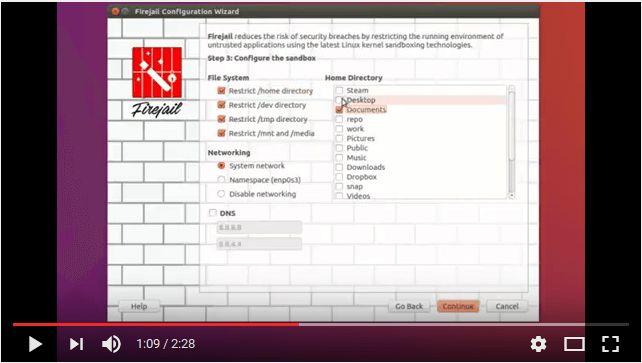

# Firetools

Firetools is the graphical user interface of Firejail security sandbox. It provides a sandbox launcher
integrated with the system tray, sandbox editing, management and statistics. The application is built
using Qt4 or Qt5 libraries.

Home page: https://l3net.wordpress.com/projects/firejail/#firetools

Download: http://sourceforge.net/projects/firejail/files/firetools/

Travis-CI status: https://travis-ci.org/netblue30/firetools

## Firejail Configurator Demo

[](https://www.youtube.com/watch?v=R8Cs0L_FXOA)

## Setting up a compilation environment on Debian/Ubuntu:
`````
$ sudo apt-get install build-essential qt5-default qt5-qmake qtbase5-dev-tools libqt5svg5 git

`````
## Compile & Install

`````
$ git clone  https://github.com/netblue30/firetools
$ cd firetools
$ ./configure
$ make
$ sudo make install-strip
`````

On CentOS 7 use "./configure --with-qmake=/usr/lib64/qt4/bin/qmake"


